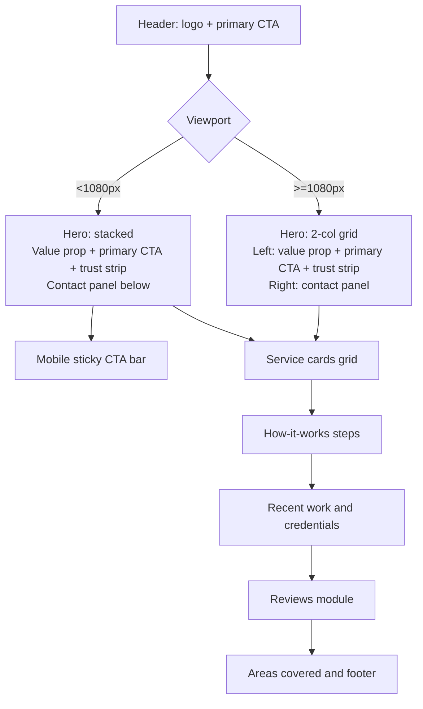

# Upgrade Implementation Summary

Date: 2026-02-27
Source recommendations: `upgrade-report.md`
Scope implemented: Visual/UI/marketing updates only (no backend/perf/SEO refactors)

## Delivery status

1. Step 1 completed: token foundation, focus system, link affordance, button hierarchy baseline.
2. Step 2 completed: trust strip moved above the fold and redesigned as icon-label reassurance badges.
3. Step 3 completed: mobile sticky CTA bar added across core pages.
4. Step 4 completed: spacing/type rhythm consistency pass plus CTA hierarchy cleanup.

## Acceptance criteria check

- Text contrast: improved through tokenized palette and button/link updates; full contrast audit (automated + manual) still recommended.
- Non-text contrast/focus clarity: implemented via global dual-layer focus ring and clearer control boundaries.
- Keyboard focus visibility: implemented site-wide via `:focus-visible` ring system.
- Hit targets: CTA buttons standardized to minimum 44px height.
- Link distinguishability: in-body links now use underlines with offset/thickness, not color-only signaling.

## Current vs recommended design tokens

| Token group | Current (from audit) | Recommended | Why it matters |
|---|---|---|---|
| Primary brand | Existing blue pair already present (`--brand`, `--brand-dark`) but less structured usage | Keep brand pair and route through clearer token hierarchy | Consistency and more professional visual language |
| Accent / highlight | Accent existed, but button contrast/text pairing was less explicit | `--accent` with explicit `--accent-ink` pairing | Reliable contrast and cleaner CTA treatment |
| Background / surfaces | Light base already in use with mixed local values | Keep `--bg`, `--card`, add tighter section/card usage | Better scannability and cleaner grouping |
| Border / dividers | Existing `--line` token, mixed direct values in components | Standardize boundaries using `--line` in cards/trust/CTA containers | Stronger structure without visual noise |
| Shadows | Mostly single shadow token | Split into `--shadow-sm` and `--shadow-md` with purpose | More coherent depth hierarchy |
| Radii | Radius tokens existed but inconsistently applied | Keep tokens and add `--radius-pill` usage across actions | More polished and consistent UI geometry |

## Current vs recommended component styling

| Component | Current (from audit) | Recommended | Priority |
|---|---|---|---|
| Hero CTAs | Home hero had 3 strong CTAs competing visually | One dominant primary + secondary + tertiary text link | High |
| Buttons (all) | Mixed weight/sizing and local focus styling | Unified min 44px buttons, stronger hierarchy, shared focus ring | High |
| Links in body copy | Some links relied mostly on color/style context | Underline system with clear hover/focus cue | High |
| Cards | Inconsistent internal spacing rhythm | Token-based card padding and gap cadence | Medium |
| Section spacing | Tighter/inconsistent section rhythm | `clamp`-based section spacing + intro spacing rules | Medium |
| Trust strip | Was below hero in text-only style | Above-the-fold icon-label reassurance strip | High |
| Reviews module | Already functional but stylistically mixed with section rhythm | Better alignment via shared spacing/button/focus systems | Medium |

## Responsive layout flowchart

## Notes and remaining optional tasks

- Screenshot baseline pack requested in recommendations (1440x900, 1024x768, 768x1024, 390x844) is not yet captured in this repo.
- Full contrast validation report (AA pass/fail values by component) is not yet documented.
- If needed, this summary can be expanded into a formal sign-off checklist with page-by-page screenshots.
