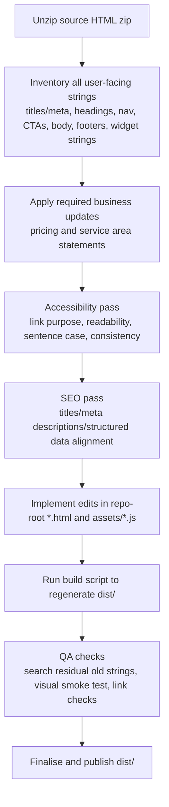

# Do deep research on improving the website text in the provided zip

You are a content designer + front-end editor. Implement the copy, accessibility, and SEO text improvements below directly in the **source HTML and assets** contained in the provided zip: `/mnt/data/New_Dvid_Electricain - Copy.zip` (edit repo-root `*.html` and `assets/*.js`, **not** `dist/`). Rebuild `dist/` using the project build script when done.

Site URL (from `sitemap.xml`): https://www.willesden-smart-homes.co.uk/

Authoritative standards underpinning the rationale:
- WCAG 2.1 link purpose: link text should make the purpose clear from the link text alone or with its immediate context. citeturn0search0turn0search10  
- UK plain-English + sentence case conventions (GOV.UK style): use sentence case even in titles/service names; avoid unnecessary capitals for readability. citeturn0search1  
- Google Search Central: use descriptive page titles; Google may rewrite title links; good titles/headings help representation in SERPs. citeturn0search3  
- Google guidance on meta descriptions: write useful, page-specific descriptions to improve snippets and set expectations (Google may choose different snippets, but quality still matters). citeturn0search6  

Notes about this site and language:
- Primary brand/site: entity["local_business","Willesden Smart Homes","London, England, UK"].
- Location context includes entity["place","Willesden","London, England, UK"] and entity["city","London","England, UK"].
- Use en‑GB spelling (“neighbourhood”, “programme” if needed, etc).
- Pricing update required now: **Call‑out fee £50** and **£50 per hour for small jobs**; **quotes available for larger projects**. Ensure old pricing and “no call‑out fee” claims are removed everywhere.

## Executive summary

Major priorities (do these first):
- Pricing accuracy: remove all references to “no call‑out fee” and socket swap pricing; replace with **£50 call‑out + £50/hour** and “quotes available for larger projects”. This is high-risk if left inconsistent because it directly affects user trust and conversion.
- Areas page clarity: restructure to present a **single, clear service area** (map + list), explicitly state **services do not vary by postcode**, and add that **other areas can be served on request** (availability confirmed case-by-case).
- Consistency: align repeated UI strings (navigation labels, footers, CTA bar) to sentence case and plain English; remove confusing duplicated navigation items and standardise the “out-of-hours” availability messaging to avoid contradictory “24/7” phrasing.
- SEO hygiene: update page-level meta descriptions where pricing/coverage changed; update structured data where it encodes outdated/unclear pricing.

## Detailed change list

Apply the changes below. “Location” includes file path + derivable URL path + a practical selector or target.

| Location (file • URL • selector/target) | Original text | Proposed rewrite | Rationale (clarity / tone / SEO / accessibility) | Priority | Effort |
|---|---|---|---|---|---|
| `index.html` • `/` • `p.hero-note` | `No call-out fee in NW10, NW2 and NW6. Socket swap labour from £45.` | `Call-out fee £50. £50 per hour for small jobs. Quotes available for larger projects.` | Pricing must be accurate and consistent; short, scannable, plain English. | High | XS (5–10 min) |
| `index.html` • `/` • `script[type="application/ld+json"]` → JSON property `priceRange` | `GBP` | `£50 call-out, £50 per hour` | SEO structured data should not be misleading/opaque; “GBP” is non-user-friendly and not a meaningful `priceRange` string. Aligns schema text with visible pricing. | Medium | XS (5–10 min) |
| `pricing-booking.html` • `/pricing-booking.html` • `head > meta[name="description"]@content` | `Transparent pricing for small electrical jobs and smart-home installs. Socket swap labour from £45, no call-out fee in NW10/NW2/NW6.` | `Clear pricing for small electrical jobs and smart home installs: £50 call-out fee and £50 per hour for small jobs. Quotes available for larger projects.` | Meta description should be page-specific and accurately summarise the content; improves snippet usefulness. citeturn0search6 | High | XS (5–10 min) |
| `pricing-booking.html` • `/pricing-booking.html` • `head > meta[name="twitter:description"]@content` | `Transparent pricing for small electrical jobs and smart-home installs. Socket swap labour from £45, no call-out fee in NW10/NW2/NW6.` | `Clear pricing for small electrical jobs and smart home installs: £50 call-out fee and £50 per hour for small jobs. Quotes available for larger projects.` | Social snippet consistency; avoids sharing outdated pricing. | High | XS (5–10 min) |
| `pricing-booking.html` • `/pricing-booking.html` • **Add** `id="pricing-signals"` on first `<section class="section">` (the one containing `h2` “Pricing Signals”) | (no id) | (add id only; no visible text) | Improves maintainability and selector stability for future edits (no UX impact). | Low | XS (5 min) |
| `pricing-booking.html` • `/pricing-booking.html` • `#pricing-signals article.card:nth-of-type(1) h3` | `Socket-Swap Labour` | `Call-out fee` | Removes outdated pricing concept; aligns with new pricing model. | High | XS (5–10 min) |
| `pricing-booking.html` • `/pricing-booking.html` • `#pricing-signals article.card:nth-of-type(1) p` | `From £45 for a like-for-like replacement (subject to site conditions and access).` | `£50 call-out fee.` | Plain English, consistent, and accurate. Keep it short so users can scan quickly. | High | XS (5–10 min) |
| `pricing-booking.html` • `/pricing-booking.html` • `#pricing-signals article.card:nth-of-type(2) h3` | `No Local Call-Out Fee` | `Hourly rate for small jobs` | Removes now-false “no call-out fee” claim; makes the pricing structure explicit. | High | XS (5–10 min) |
| `pricing-booking.html` • `/pricing-booking.html` • `#pricing-signals article.card:nth-of-type(2) p` | `No call-out fee inside NW10, NW2 and NW6.` | `£50 per hour for small electrical jobs and smart home installations (subject to site conditions and access).` | Clear pricing statement; en‑GB plain English; keeps conditions disclaimer without legalese. | High | XS (5–10 min) |
| `pricing-booking.html` • `/pricing-booking.html` • `#pricing-signals article.card:nth-of-type(3) h3` | `Fixed Prices Available` | `Quotes for larger projects` | User requirement: “quotes available for larger projects” should be prominent and unambiguous. | High | XS (5–10 min) |
| `pricing-booking.html` • `/pricing-booking.html` • `#pricing-signals article.card:nth-of-type(3) p` | `Common smart-home installs can often be quoted at a fixed price after photos.` | `Quotes are available for larger or multi-step projects after photos and a brief chat.` | Plain English; avoids “often” ambiguity; sets expectation for what’s needed. | High | XS (5–10 min) |
| `pricing-booking.html` • `/pricing-booking.html` • `footer ul li` containing pricing highlight • `body > footer … li:nth-of-type(4)` | `No call-out fee in NW10/NW2/NW6` | `£50 call-out fee; £50 per hour for small jobs.` | Removes false claim and keeps footer consistent with updated pricing. | High | XS (5–10 min) |
| `areas.html` • `/areas.html` • `head > meta[name="description"]@content` | `Local electrician and smart-home installer covering Willesden, Kensal Green, Queen's Park, Brondesbury, Kilburn, Cricklewood and nearby NW postcodes.` | `Covering Willesden (NW10), Kensal Green, Queen’s Park, Brondesbury, Kilburn and Cricklewood (NW2/NW6). Other nearby areas on request.` | Coverage accuracy + “other areas on request” requirement; page-specific snippet. citeturn0search6 | Medium | XS (5–10 min) |
| `areas.html` • `/areas.html` • `head > meta[name="twitter:description"]@content` | `Local electrician and smart-home installer covering Willesden, Kensal Green, Queen's Park, Brondesbury, Kilburn, Cricklewood and nearby NW postcodes.` | `Covering Willesden (NW10), Kensal Green, Queen’s Park, Brondesbury, Kilburn and Cricklewood (NW2/NW6). Other nearby areas on request.` | Social snippet consistency with updated page intent. | Medium | XS (5–10 min) |
| `areas.html` • `/areas.html` • `section.page-hero p` (intro paragraph under H1) | `Primary service area includes Willesden and nearby neighbourhoods across NW10, NW2 and NW6. For nearby streets just outside these postcodes, contact me to confirm availability.` | `Based in Willesden (NW10). My main service area covers NW10, NW2 and NW6 for small electrical jobs, smart home installations and Siemens LOGO! mini‑automation. The services I offer are the same across the area — only travel time and available booking slots vary. Outside these postcodes? Get in touch and I’ll confirm availability.` | Directly addresses the user request: single service area framing, no postcode-based service differences, and “other areas on request”. Improves clarity and removes implied postcode-tiered offering. | High | S (15–30 min) |
| `areas.html` • `/areas.html` • `section#willesden h2` | `Electrician in Willesden (NW10)` | `Main service area (NW10, NW2 and NW6)` | Reframes section away from “different services by postcode”; keeps SEO-relevant postcodes but clearly makes it one service area. citeturn0search3 | High | XS (5–10 min) |
| `areas.html` • `/areas.html` • `section#willesden article.card p` | `Local help for small electrical jobs, smart-home upgrades, and practical fault fixes in Willesden. Fast quote turnarounds for customers who can share clear photos and postcode details.` | `One service area, one service standard — across NW10, NW2 and NW6. Share your postcode, a short description and a couple of clear photos for a fast quote.` | Reinforces “not postcode-specific services”, keeps actionable guidance, tightens phrasing. | High | XS (5–10 min) |
| `areas.html` • `/areas.html` • `section#willesden article.card a` | `View Willesden on map` | `View main service area on map` | Improves link purpose and matches new “single service area map” requirement. Link purpose should be clear from the label. citeturn0search0 | High | XS (5–10 min) |
| `areas.html` • `/areas.html` • `section#willesden article.card a@href` | `https://maps.google.com/?q=Willesden+London+NW10` | Use a single service-area query, e.g. `https://www.google.com/maps/search/?api=1&query=NW10%20NW2%20NW6%20London` | Aligns with “single service area map” requirement; avoids implying the map is only Willesden if the page is for NW10/NW2/NW6 coverage. | Medium | XS (5–10 min) |
| `areas.html` • `/areas.html` • `section#willesden article.card` (add list block under paragraph) | (no list) | Add a short list: `NW10: Willesden, Kensal Green` / `NW2: Kilburn, Cricklewood` / `NW6: Queen’s Park, Brondesbury` | “Single map or list” requirement. A short list is quickly scannable and reduces postcode confusion. | High | S (15–30 min) |
| `areas.html` • `/areas.html` • `section#kensal-green` restructure (add intro heading + paragraph above grid cards) | (no section heading; cards start immediately) | Add `h2` `Neighbourhoods in the main service area` + `p` `Examples of places I regularly cover. Services offered are the same across the area.` | Adds context so the cards don’t imply different offerings by neighbourhood; improves page structure and readability. Heading structure helps users scan. citeturn0search5turn0search11 | High | S (20–40 min) |
| `areas.html` • `/areas.html` • `section#kensal-green article.card:nth-of-type(2) p:first-of-type` (Queen’s Park card body) | `Ideal for smart-home tuning, camera setup and reliability fixes after router changes.` | `Common requests include smart home tuning, camera setup and reliability fixes after router changes.` | Consistent framing across cards (“common requests”), avoids “ideal for” marketing vagueness. | Medium | XS (5–10 min) |
| `areas.html` • `/areas.html` • `section#kensal-green article.card:nth-of-type(3) p:first-of-type` (Brondesbury card body) | `Support for non-notifiable small works and straightforward, practical upgrades.` | `Common requests include small electrical repairs and straightforward, practical upgrades.` | Removes jargon (“non-notifiable”) in a consumer-facing card; plain English. | Medium | XS (5–10 min) |
| `areas.html` • `/areas.html` • Remove sections `section#nw2` and `section#nw6` entirely | H2s and copy for NW2/NW6 (including “Request NW2 quote”, “Request NW6 quote”) | Delete these blocks; coverage is now described once in the hero + main service area list + neighbourhood cards. | These sections are the primary source of the postcode-tiered impression. Removing them meets the user requirement while retaining NW2/NW6 mentions elsewhere on the page. | High | S (20–40 min) |
| `areas.html` • `/areas.html` • `h2:contains("Travel and Booking Notes") + p` | `No call-out fee inside NW10/NW2/NW6. Limited evening and weekend slots may be available with advance booking. For larger notifiable projects, a registered electrician can be arranged.` | `Call-out fee is £50, with £50 per hour for small jobs. Evening and weekend slots are limited and usually need advance booking. Outside NW10/NW2/NW6? Get in touch and I’ll confirm availability (and any extra travel time) before you commit. For larger notifiable projects, a registered electrician can be arranged.` | Implements the required pricing change; adds “other areas on request” explicitly; keeps compliance route note; improves expectation-setting. | High | S (15–30 min) |
| `areas.html` • `/areas.html` • Travel CTAs: `section.section:last-of-type a.btn.btn-primary` | `Check My Postcode` | `Check my postcode` | Sentence case improves readability and consistency with UK style guidance. citeturn0search1 | Low | XS (5 min) |
| `areas.html` • `/areas.html` • Travel CTAs: `section.section:last-of-type a.btn.btn-secondary` | `See Pricing` | `See pricing` | Sentence case consistency. citeturn0search1 | Low | XS (5 min) |
| All pages except `index.html` • footer hours list item • find the exact string `Mon–Sat 08:00–18:00 (24/7 emergency call-outs subject to availability)` | `Mon–Sat 08:00–18:00 (24/7 emergency call-outs subject to availability)` | `Mon–Sat 08:00–18:00. Out-of-hours emergency call-outs may be available — call or text to check.` | Removes contradictory “24/7 … subject to availability” phrasing; aligns with plain English expectation-setting and reduces confusion across pages. citeturn0search1 | High | S (20–40 min) |
| All pages • desktop main nav remove duplicate top-level items • `nav.main-nav > ul > li` containing `Smart Home` and `Automation` | Top-level links duplicate the dropdown items (same destinations) | Remove the two duplicate `<li>` items so the “Services” dropdown is the single source for those destinations on desktop | Reduces cognitive load and repeated links (useful for screen-reader link lists too). Improves navigation clarity and avoids redundant labels. citeturn0search0 | Medium | S (20–40 min) |
| All pages • services dropdown labels • `nav.main-nav #services-menu a[role="menuitem"]` | `All Services` / `Small Electrical Jobs` / `Smart Home Upgrades` / `Mini Automation` | `All services` / `Small electrical jobs` / `Smart home installations` / `Mini automation` | Sentence case + clearer labels; reduces inconsistent capitalisation; improves scan comprehension. citeturn0search1turn0search11 | Medium | S (20–40 min) |
| All pages • mobile nav labels • `nav.mobile-nav a[href="smart-home.html"]` | `Smart Home` | `Smart home` | Sentence case consistency; reduces “Title Case drift” across UI labels. citeturn0search1 | Low | XS (5–10 min) |
| All pages • mobile nav label for FAQ • `nav.mobile-nav a[href="faq.html"]` | `FAQ` | `FAQs` | Matches user language and page meaning (“Frequently Asked Questions”); small clarity improvement. | Low | XS (5–10 min) |
| All pages • mobile CTA bar primary tel button • `div.mobile-cta-bar a[href^="tel:"]` (the one currently labelled “Call / Text”) | `Call / Text` | `Call or text` | Plain English, removes slash shorthand; clearer for all users. citeturn0search1 | Medium | S (15–30 min) |
| `about.html` • `/about.html` • CTA link text in card section • (the `a.btn.btn-secondary` currently “View Services”) | `View Services` | `See services` | CTA standardisation: consistent action language and sentence case. citeturn0search1 | Low | XS (5–10 min) |
| `contact.html` • `/contact.html` • CTA link text in section with “View Services” | `View Services` | `See services` | CTA standardisation. citeturn0search1 | Low | XS (5–10 min) |
| `index.html` • `/` • Google reviews CTA button text (currently “View Google Profile”) | `View Google Profile` | `Read reviews on Google` | More explicit link purpose; clearer out of context; improves accessibility link clarity. citeturn0search0 | Medium | XS (5–10 min) |

## Before-and-after full-page text snapshots

Create these snapshots **after implementing** the change list (capture the rendered text in user reading order: title/meta → H1/H2 → key paragraphs → CTAs → footer highlights).

### `index.html` snapshot

Before:
- Title: `Smart-Home Electrician for Small Jobs in Willesden | NW10, NW2, NW6`
- Meta description: `Small electrical jobs and smart-home upgrades in Willesden and NW London. Nest/Hive setup, video doorbells, smart lighting controls, tested and tidy work.`
- H1: `Tech-Savvy Electrician for Small Jobs and Smart-Home Upgrades`
- Hero CTAs: `Call or text: 07407 023 280` / `Get a quote` / `See services`
- Hero note: `No call-out fee in NW10, NW2 and NW6. Socket swap labour from £45.`

After:
- Title: unchanged
- Meta description: unchanged
- H1: unchanged
- Hero CTAs: unchanged
- Hero note: `Call-out fee £50. £50 per hour for small jobs. Quotes available for larger projects.`

### `services.html` snapshot

Before:
- Title: `Electrical Services in Willesden | Small Jobs, Smart Home, Automation`
- Meta description: `Expanded service list: small electrical jobs, Nest/Hive setups, doorbells, CCTV, smart controls and Siemens LOGO! mini-automation in NW London.`
- H1: `Electrical services in Willesden and NW London`
- Desktop Services dropdown includes items in Title Case (`All Services`, `Small Electrical Jobs`, etc)
- Footer highlight line includes: `Mon–Sat 08:00–18:00 (24/7 emergency call-outs subject to availability)`

After:
- Title/meta/H1: unchanged
- Desktop Services dropdown items: `All services`, `Small electrical jobs`, `Smart home installations`, `Mini automation`
- Footer highlight line: `Mon–Sat 08:00–18:00. Out-of-hours emergency call-outs may be available — call or text to check.`

### `about.html` snapshot

Before:
- Title: `About David | Local Smart-Home Electrician in Willesden, London`
- Meta description: `Meet David from Willesden Smart Homes. 10+ years of electrical experience, smart-home expertise, tidy workmanship and BS 7671-tested installations.`
- H1: `About David`
- CTA in final section includes: `View Services`
- Footer highlight line includes: `Mon–Sat 08:00–18:00 (24/7 emergency call-outs subject to availability)`

After:
- Title/meta/H1: unchanged
- CTA: `See services`
- Footer highlight line: updated (same string as above)

### `areas.html` snapshot

Before:
- Title: `Areas Covered | Electrician in Willesden, NW10, NW2, NW6`
- Meta description: `Local electrician and smart-home installer covering Willesden, Kensal Green, Queen's Park, Brondesbury, Kilburn, Cricklewood and nearby NW postcodes.`
- H1: `Electrician Coverage Across NW London`
- Intro: `Primary service area includes Willesden and nearby neighbourhoods across NW10, NW2 and NW6. For nearby streets just outside these postcodes, contact me to confirm availability.`
- H2s: `Electrician in Willesden (NW10)` / `Electrician in NW2` / `Electrician in NW6` / `Travel and Booking Notes`
- Travel note starts: `No call-out fee inside NW10/NW2/NW6...`
- Buttons: `Check My Postcode` / `See Pricing`
- Footer highlight line includes “24/7 … subject to availability”

After:
- Title: unchanged (or keep consistent if you choose to adjust later)
- Meta description: `Covering Willesden (NW10), Kensal Green, Queen’s Park, Brondesbury, Kilburn and Cricklewood (NW2/NW6). Other nearby areas on request.`
- H1: unchanged
- Intro explicitly states:
  - one main service area
  - services do not vary by postcode
  - other areas can be served on request
- H2: `Main service area (NW10, NW2 and NW6)`
- A scannable list of postcodes + neighbourhood examples appears in the main service area card
- A new heading above neighbourhood cards: `Neighbourhoods in the main service area` plus short context line
- Sections `#nw2` and `#nw6` removed
- Travel note includes updated pricing and “other areas on request” statement
- Buttons: `Check my postcode` / `See pricing`
- Footer highlight line updated to the plain-English out-of-hours wording

### `pricing-booking.html` snapshot

Before:
- Title: `Pricing and Booking | Electrician in Willesden, NW10, NW2, NW6`
- Meta description: includes `Socket swap labour from £45, no call-out fee in NW10/NW2/NW6.`
- H1: `Transparent, Neighbourly Pricing`
- Pricing signals cards:
  - `Socket-Swap Labour` → `From £45...`
  - `No Local Call-Out Fee` → `No call-out fee inside...`
  - `Fixed Prices Available` → `Common smart-home installs...`
- Footer includes “24/7 … subject to availability” and “No call-out fee…”

After:
- Meta description: `Clear pricing for small electrical jobs and smart home installs: £50 call-out fee and £50 per hour for small jobs. Quotes available for larger projects.`
- H1: unchanged
- Pricing signals cards:
  - `Call-out fee` → `£50 call-out fee.`
  - `Hourly rate for small jobs` → `£50 per hour for small electrical jobs and smart home installations (subject to site conditions and access).`
  - `Quotes for larger projects` → `Quotes are available for larger or multi-step projects after photos and a brief chat.`
- Footer: out-of-hours wording updated; pricing highlight updated to “£50 call-out … £50 per hour …”

## Suggested style-guide rules for ongoing consistency

Apply these rules to any future edits (keep the site cohesive and WCAG-friendly):

Casing and labels:
- Use sentence case for navigation labels, headings, buttons and links (capitals only for proper nouns). citeturn0search1turn0search11  
- Prefer action-led CTAs: “Get a quote”, “See services”, “See pricing”, “Check my postcode”.

Terminology and tone:
- Use “smart home” (no hyphen) in most UI text; reserve “smart-home” only if it’s part of an established page title you’re intentionally keeping.
- Avoid postcode-driven phrasing that implies different offerings; instead: “services are the same across the area; travel time and slots vary.”
- State pricing consistently as: “Call-out fee £50” and “£50 per hour for small jobs”; avoid mixing with superseded examples like socket swap pricing.

Accessibility and plain English:
- Link text should be meaningful in a list of links (avoid generic “View” + ambiguous object). citeturn0search0  
- Avoid shorthand symbols (“/”, “+”) in user-facing CTAs (“Call or text”, “Send a message and photos”), unless space constraints are extreme.
- Avoid contradictory availability constructions like “24/7 … subject to availability”; use a single expectation-setting phrasing everywhere.

SEO alignment:
- Keep page titles descriptive and not overly generic; titles influence how Google displays title links. citeturn0search3  
- Meta descriptions should be accurate, page-specific, and updated when pricing/coverage changes. citeturn0search6  

## Optional sample HTML snippets

Use these as patterns; adapt to the site’s existing classes/layout.

### Areas page snippet (single service area map + explicit “same services” note)

```html
<!-- In areas.html: section#willesden -->
<h2 class="reveal">Main service area (NW10, NW2 and NW6)</h2>

<article class="card reveal">
  <p>
    One service area, one service standard — across NW10, NW2 and NW6.
    Share your postcode, a short description and a couple of clear photos for a fast quote.
  </p>

  <ul class="list">
    <li>NW10: Willesden, Kensal Green</li>
    <li>NW2: Kilburn, Cricklewood</li>
    <li>NW6: Queen’s Park, Brondesbury</li>
  </ul>

  <p>
    <a
      href="https://www.google.com/maps/search/?api=1&query=NW10%20NW2%20NW6%20London"
      target="_blank"
      rel="noopener"
    >
      View main service area on map
    </a>
  </p>
</article>

<!-- Restructure section#kensal-green to add heading + intro above the grid -->
<section class="section" id="kensal-green">
  <div class="container">
    <h2 class="reveal">Neighbourhoods in the main service area</h2>
    <p>Examples of places I regularly cover. Services offered are the same across the area.</p>
  </div>

  <div class="container grid grid-2">
    <!-- existing article cards unchanged except copy tweaks -->
  </div>
</section>
```

### Pricing snippet (new call-out + hourly + quotes)

```html
<!-- In pricing-booking.html: add id="pricing-signals" on the section -->
<section class="section" id="pricing-signals">
  <div class="container">
    <h2 class="reveal">Pricing Signals</h2>

    <div class="grid grid-3">
      <article class="card reveal">
        <h3>Call-out fee</h3>
        <p>£50 call-out fee.</p>
      </article>

      <article class="card reveal">
        <h3>Hourly rate for small jobs</h3>
        <p>£50 per hour for small electrical jobs and smart home installations (subject to site conditions and access).</p>
      </article>

      <article class="card reveal">
        <h3>Quotes for larger projects</h3>
        <p>Quotes are available for larger or multi-step projects after photos and a brief chat.</p>
      </article>
    </div>
  </div>
</section>
```

## Review-to-implementation workflow



## Implementation steps and QA checks

Follow these steps exactly:

1) Unzip the source:
- Unzip `/mnt/data/New_Dvid_Electricain - Copy.zip`
- Work inside the extracted folder: `New_Dvid_Electricain - Copy/`
- Edit **repo-root** files: `index.html`, `services.html`, `about.html`, `areas.html`, `pricing-booking.html`, and any other affected `*.html`. Do **not** hand-edit `dist/`.

2) Implement the change list table:
- Apply pricing updates first (`index.html` hero note, `pricing-booking.html` meta + cards + footer, `areas.html` travel note).
- Restructure `areas.html` to:
  - include single service area map + list
  - remove `section#nw2` and `section#nw6`
  - add explicit statement that services do not vary by postcode
  - add “other areas on request” availability statement
- Update footers across pages to remove the “24/7 … subject to availability” phrasing and replace with the consistent out-of-hours wording.
- Update navigation duplicates and label casing as specified.

3) Rebuild deployable output:
- From repo root, run: `bash scripts/build-dist.sh`
- Confirm `dist/` is regenerated and contains updated HTML.

4) QA checks (must pass):
- Full-text searches (repo root, including `dist/` after rebuild):
  - Search for residual outdated strings:
    - `£45`
    - `Socket swap`
    - `No call-out fee`
    - `24/7 emergency call-outs subject to availability`
    - `All Services` (if you implemented sentence-case nav labels)
    - `Call / Text`
    - `View Services` (if you standardised to “See services”)
    - `GBP` (ensure only appropriate uses remain; JSON-LD `priceRange` must be updated)
    - `file:///` (should be none)
- Link checks:
  - Confirm Areas page has one clear “View main service area on map” link and no NW2/NW6 quote-request links that imply postcode-tiered services.
  - Confirm pricing page has no “no call-out fee” phrasing anywhere (including meta tags and footer).
- Accessibility spot-checks:
  - In navigation, no duplicate destination links with different labels on desktop.
  - Link labels remain meaningful out of context (especially map links and Google review links). citeturn0search0  
- Visual smoke test (open `dist/index.html`, `dist/areas.html`, `dist/pricing-booking.html` locally):
  - Headings appear in expected hierarchy.
  - No broken layouts from the `section#kensal-green` restructure.

5) Final consistency confirmation:
- Pricing communicates the same structure everywhere it appears: **£50 call-out**, **£50/hour (small jobs)**, **quotes for larger projects**.
- Areas page communicates one service area and that services do not differ by postcode; other areas are available on request (availability confirmed).